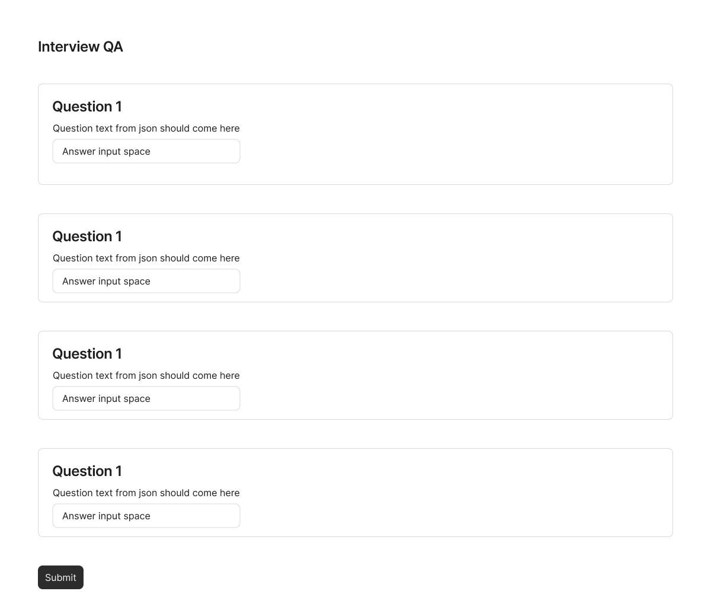

# Interview Task

This project was bootstrapped with [Create React App](https://github.com/facebook/create-react-app).

### `npm start`

Runs the app in the development mode. Open [http://localhost:3000](http://localhost:3000) to view it in your browser.

The page will reload when you make changes. You may also see any lint errors in the console.

## Task Details

### Functionality Description

Create an app that shows a list of questions with spaces below to answer those questions. The list of questions that need to be shown are present in the `src/assets/questions.json` file.

Structure of the `questions.json` file

```
[
	...
    ...
    {
		"questionText": "What is your name?", //text to be displayed
		"optional": false //whether the answer is required on submission
	},
	{
		"questionText": "What is react?",
		"optional": false
	},
    ...
    ...
]

```

### UI Description

You are free to use any UI framework, but keep it simple and light weight. You can use the following UI wireframe to make your UI. You can experiement with creating a nice UI but it should be clean.


### TODOs

1. Load the question data from the `questions.json` file using `fetch` or `axios`. DO NOT hardcode the questions into the html. If more questions are added into the questions.json then the UI should show that when page is refreshed

2. Answer the questions, the answers do not have to be in too much detail. Two or three sentences are fine.

3. Once the submit button is clicked, the questions and their answers should be saved in a another json file called `answers.json`. The content inside should look like the sample file found in `sample-answer.json`

### Submission

Fork the repository on your github account, make the repository as private and add `zhbhmd` as a collaborator.

### FAQ

- You can use textarea instead of input tag
- If you are having trouble running this project, then create a new create-react-app project from scratch
